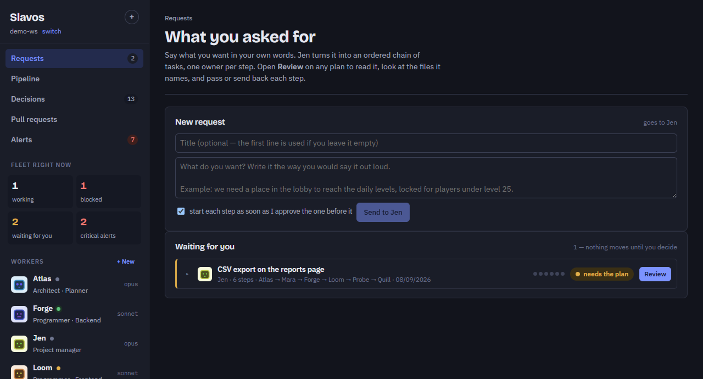
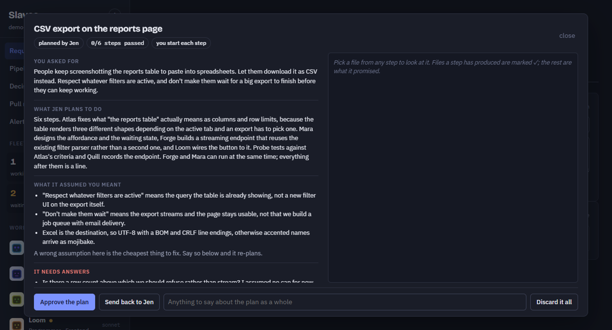
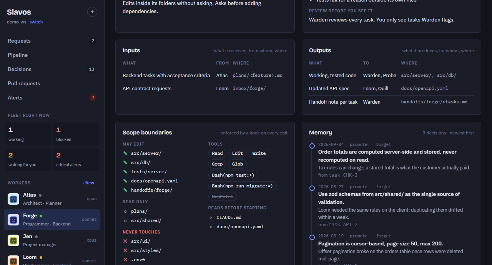

# OpenJen

Scoped worker agents on Claude Code or the Gemini CLI, with a manager that plans and a human who approves.



<!-- A 20-30s screen recording of a plan being approved step by step would sell this better
     than the still. Save it as docs/demo.gif and swap it in above. -->

A crew manifest for Claude Code and the Gemini CLI. OpenJen manages a set of scoped **worker** agents for a project: what each one is responsible for, what it must not touch, what it receives and produces, the rules it follows, the decisions it has already made, which model it runs on, and which of the two suppliers runs it. It compiles that manifest into real Claude Code agent files for a worker on Claude, and into a brief plus a scope-checked MCP server for a worker on Gemini, enforcing every worker's file scope either way.

## What is different about it

- **A worker cannot edit outside its lane.** Not "is asked not to" — a `PreToolUse` hook denies the write, in interactive sessions and headless runs alike. Reach and permission are separate axes: handing a worker a folder so it can read there does not give it the right to change anything in it.
- **A manager never runs as a worker.** Tell one what you want and it writes a plan file: a chain of tasks, one per worker, with deliverables and acceptance for each. OpenJen creates the tasks, not the manager. You approve the plan, then every finished step, before the next one starts.
- **You can talk to the app itself.** **Ask OpenJen** reads the project and writes the crew you describe. It never edits your project files and never starts runs: it writes one operations file, and the engine validates it and applies it, so a model can propose a worker but cannot corrupt the manifest.
- **Nothing on the network.** No port, no database, no account, no telemetry. The window reaches its engine over a named pipe with a random name generated at launch, and every byte of state is JSON files inside your own project folder under `.openjen/` and in `~/.openjen/config.json`.

> **Platform:** built and tested on Windows. The code branches for macOS and Linux and may well run there from source with `npm start`, but only Windows is packaged and verified. Reports welcome.

## Run it

OpenJen is a desktop app. Build it once and start it:

```bash
npm install
npm start
```

That opens the OpenJen window, and that is the whole app. There is nothing to start by hand, no browser tab to keep, and no address to remember — closing the window shuts everything down.

The project name under the OpenJen title opens the project menu: every folder OpenJen knows, **New project…** (choose where it goes, name it, and OpenJen makes the folder), **Add existing folder…**, and **Project settings** for repositories and compile. Then create workers, ask OpenJen for a crew, or load the sample one.

Every workspace is a separate project. Its workers, decisions, tasks, runs and portraits live in that folder's `.openjen/` directory and nothing is shared between workspaces. **Home** is the first page of each: what is waiting for you, what is running, the crew, and what just happened. Panels fold away when they are in the way — click a panel header — and so does the sidebar; both remember.

### Connect an account

A worker runs on one of two suppliers, picked per worker: the **Claude** CLI or the **Gemini** CLI. Before you run anything, open **Accounts** in the sidebar and connect whichever ones you plan to use.

For Claude, press **Connect** and finish the login the CLI shows. For Gemini, if the CLI is not already on your machine the card leads with **Install** instead: pressing it runs

```bash
npm install -g @google/gemini-cli
```

in a terminal you can watch — the same command is shown on the page, in case you would rather type it yourself or a firewall keeps OpenJen from opening a terminal. The page polls on its own and offers **Connect** the moment the CLI appears; connecting opens a second terminal for the CLI's own Google sign-in. Either way, the page then shows your account and plan.

OpenJen stores no credentials itself, for either supplier — it always uses the CLI's own login, exactly as if you were running `claude` or `gemini` commands by hand. **OpenJen never accepts or stores an API key, for any supplier**: an `ANTHROPIC_API_KEY`, `GEMINI_API_KEY`, `GOOGLE_API_KEY`, `GOOGLE_APPLICATION_CREDENTIALS` or `GOOGLE_GENAI_USE_VERTEXAI` found in your environment is ignored on purpose and reported on the Accounts page as ignored, so every run bills to the login you authorized in the app and never to a key set somewhere else. OpenAI appears on the Accounts page as a placeholder and does not work yet.

Pick a worker's supplier in its editor, next to its model — the model list changes to that supplier's own choices. A worker never quietly runs on the other supplier: if the one it is set to is not installed or not signed in, the run refuses to start and says so, rather than spending someone else's subscription on work they did not choose it for.

### About OpenJen

Click **OpenJen [version]** in the sidebar footer to open the About panel. It tells you what this app does, which version you are running, whether a newer one is out, where your project settings live, and links to both the source repository and the public downloads page. A few seconds after starting, OpenJen checks for updates with a plain anonymous https request to the public downloads page; the GitHub CLI is only the fallback, for a machine behind a proxy or a release that is not public.

### Install it properly

```bash
npm run dist:win
```

`release/` then holds an installer (per-user, with Start menu and desktop shortcuts) and a single-file portable exe. The same two files for the current version are on the public [downloads page](https://github.com/kutiman/OpenJen-releases/releases/latest), if you would rather not build them. Installed, OpenJen launches like any other Windows app and needs neither Node nor this repository — but the workers it starts do need the `claude` CLI on your PATH (and the `gemini` CLI too, for any worker on Gemini — OpenJen can install that one for you from the Accounts page), and pull requests need `gh`.

An installed copy of OpenJen is not upgraded in place: the application ID changed from Slavos, so OpenJen installs beside it if you have the old one. Uninstall the old entry by hand if you do not need it. The first launch after upgrading must fully quit and relaunch the app once, because the migration from the old `.slavos/` state folder to `.openjen/` runs at engine startup.

### Cutting a release

Releases are built on GitHub, never on anyone's machine: **Actions → Release → Run workflow**, pick `patch`, `minor` or `major`, and press the button. A Windows runner writes the version to `package.json`, builds the installer and the portable exe (with one automatic retry, because electron-builder fetches NSIS mid-build and the runner's network drops that often enough to matter), and only after both exes are on disk does it commit, tag, and publish both. The order matters: a build that dies on a flaky download must leave the repository exactly as it was, rather than a bumped version and a tag with no release under it. The CI build runs with `--publish never` so electron-builder does not publish behind the workflow's back.

**The two exes are published somewhere else than this source.** They go to [kutiman/OpenJen-releases](https://github.com/kutiman/OpenJen-releases/releases), a public repository that holds downloads and nothing else, so that installing OpenJen and updating it need no GitHub account, no token and no `gh`. This repository keeps the source, the history and the version tag; only the builds cross over. The address is `openjen.releases` in `package.json`, which is the same field the updater reads, so where the workflow pushes and where a running OpenJen looks cannot drift apart. There is no fallback to this source repository: a build whose `package.json` does not name a downloads repository simply does not check for updates.

This README is published there too. `.github/workflows/mirror-readme.yml` copies `README.md` to the downloads repository on every push to master that touches `README.md` or `docs/`, and can be run by hand from Actions when you want the public copy updated sooner than the next push. It carries along every screenshot the README embeds, because the image paths are relative and would otherwise render broken to the public. It writes through the GitHub contents API, with the same `RELEASE_TOKEN` secret and the same `openjen.releases` address out of `package.json` that the release workflow uses — never a hardcoded repository name. The copy over there is never edited by hand: the next mirror run overwrites it. This is deliberately not folded into `release.yml`: a README fix should reach the public the day it is written, not wait for a version bump.

Publishing into another repository needs a token this workflow's own `GITHUB_TOKEN` cannot be: a fine-grained personal access token with **Contents: read and write** on the downloads repository, stored here as the `RELEASE_TOKEN` secret. The workflow checks it before it builds anything, so a missing or expired token costs two seconds rather than a fifteen-minute build. Release notes are written by the workflow from the commits since the last tag — `--generate-notes` reads the history of the repository it publishes into, and the downloads repository has none of this one's — and end with the short SHA they were built from, which is the only thing over there that says which source a given exe came out of.

The same workflow also runs on a `v*` tag you push yourself, for when you want to choose the commit:

```bash
npm version minor          # bumps package.json and tags it
git push --follow-tags
```

It refuses a tag whose number disagrees with `package.json`, because the installer takes its version from the file, not the tag — a mismatch would publish a release with the wrong version number in the installer filename.

### Getting the release

A few seconds after OpenJen starts, it checks the [release page](https://github.com/kutiman/OpenJen-releases/releases) for updates. If a newer version is available, the sidebar footer displays an update notice. Hovering shows what changed and how big the download is; clicking downloads the installer and runs it, and OpenJen closes while it installs. It refuses while a worker is running, rather than stopping one mid-run to update itself.

Both the question and the download are plain https, anonymous, against a public page: no token, no account, and no `gh` needed to stay up to date. The `gh` CLI is still the fallback, for the two places Node's `fetch` does not reach — through a corporate proxy, and into a release that is not public — and a download it hands back is checked against the length the release page advertised, because a truncated installer that reported success would be run as a real one. If every path fails, nothing appears: the check fails quietly, because a nag about a release you cannot fetch is worse than no nag at all.

### Nothing on the network

OpenJen does not open a port. The window loads from its own `openjen://` scheme and the engine behind it — the same Express app, with the workers, the git work and the file store — listens on a Windows named pipe with a random name generated at launch. Requests travel window → pipe → engine and never touch TCP, so no browser, no page you have open, and no other machine can reach the API that starts Claude Code agents in your repositories.

The pipe dies with the window, along with any worker still running under it.

### Develop it

```bash
npm run app:dev   # app window with hot reload
npm run dev       # the same without a window: UI on 5173
```

Both point the UI at Vite on 5173 so edits appear on save, and both start the engine on loopback TCP (port 4141) instead of the pipe, because Vite's proxy cannot speak to a pipe. That is the only way a port is ever opened, it takes an explicit `--dev-http`, and the shipped app never does it. `npm run app:dev` puts that in a window; `npm run dev` leaves you in the browser. **View → Reload** reloads the window.

## How it fits Claude Code

Everything lives inside the project you are managing:

| Path | Written by | Purpose |
| --- | --- | --- |
| `.openjen/workers/*.json` | OpenJen | One file per worker: the full dossier |
| `.openjen/decisions/*.json` | OpenJen and the workers themselves | One file per decision. Workers are told to record decisions here |
| `.openjen/tasks/*.json`, `.openjen/runs/*` | OpenJen | Task board and run logs |
| `.openjen/avatars/` | OpenJen | Uploaded portraits |
| `.openjen/attachments/<owner id>/` | OpenJen | Files pasted, dropped or picked onto a request or a console turn — the owner id is the request's or the message's own id |
| `.openjen/assets.json` | OpenJen and you | Things the crew makes or depends on: repositories, sites, builds, services, documents, datasets |
| `.openjen/console.json` | OpenJen | The Ask OpenJen conversation and the CLI session it resumes |
| `.openjen/inbox/crew/*.json` | Ask OpenJen | Changes to the crew, waiting to be validated and applied |
| `.openjen/inbox/triage/*.json` | Triage | Decision triage verdicts, waiting to be validated and applied |
| `.claude/agents/<worker>.md` | Compile | For a worker on Claude: the Claude Code subagent — frontmatter (model, tools, memory, hook) plus the compiled brief |
| `.claude/openjen/scope-guard.mjs` | Compile | PreToolUse hook that denies Edit and Write outside a worker's "may edit" paths |
| `.claude/openjen/scopes.json` | Compile | Each worker's may-edit and never-touch lists, read by the guard |
| `.claude/settings.json` | Compile (merged) | Registers the guard so headless runs are covered too |
| `.claude/agent-memory/<worker>/` | Claude Code | The worker's own memory, shown in its dossier |
| `.gemini/openjen/<worker>.md` | Compile | For a worker on Gemini: the same compiled brief as a plain file — the gemini CLI has no agent file to load, so this is put at the top of the prompt instead |
| `.gemini/openjen/scope-server.mjs` | Compile | The MCP server a Gemini run writes through, enforcing the same may-edit and never-touch lists as the Claude hook |
| `.gemini/settings.json` | OpenJen, per run | Registers that server and excludes the CLI's own file-writing and shell tools, so nothing can go around it |

Press **Compile to Claude** after editing workers or recording decisions. Runs started from OpenJen compile automatically first.

### Running a worker

For a worker on Claude, OpenJen starts `claude -p "<prompt>" --agent <worker> --output-format stream-json` in the workspace, with the worker's model, permission mode, turn limit and budget. Because the worker is a normal Claude Code agent, you can also use it from an interactive session in that folder: Claude Code picks it up from `.claude/agents/`.

For a worker on Gemini, OpenJen starts the `gemini` CLI instead, with its compiled brief at the top of the prompt (there is no agent file to load) and its own file-writing and shell tools switched off for the run — every change instead goes through the small MCP server described above, checked against the same scope. If that fence cannot be confirmed on the machine the run is about to start on, the run refuses to start rather than running unfenced. Either way, the transcript streams into the run page.

### Ask OpenJen

The **Ask OpenJen** page is a conversation with the app about this workspace, on the supplier you pick for it — Claude by default. It is a run with no agent file behind it, and it can do exactly two things: read the project, and write one change file to `.openjen/inbox/crew/`. On Claude, each turn resumes the CLI's own session, so it remembers what you both said; the gemini CLI has no session to resume, so a Gemini conversation carries what has been said so far in the prompt instead, trimmed to the most recent part once it runs long. Either way it never falls back to the other supplier — if the one you picked is not installed or signed in, it says so rather than answering as a different model on a subscription you did not choose for it.

```
you      Look at this project and give me a crew for it.
OpenJen  Four workers: Forge on the API, Loom on the UI, Probe on tests, Quill on docs.
         Forge and Loom cannot touch each other's folders; Probe writes only under tests/.
         applied · created worker Forge (forge) · created worker Loom (loom) · …
```

The engine — not the model — validates each operation against the same schema the forms use, applies what checks out, recompiles the agent files, and prints what it did under the reply. An operation that does not check out changes nothing and comes back as a sentence. It can create, change and remove workers, give them tasks, and record decisions; it cannot edit a file in your project, and it cannot start a worker. The scope guard enforces both, under the reserved id `openjen-console`.

### Attaching files

Both the New request box and Ask OpenJen take more than words: paste a screenshot straight into the box, drop a file (or several) onto it, or press **+** to pick one. Each shows up as a chip with a thumbnail or a glyph, its name and its size, removable with an × until you send. Once sent, the crew reads them as real files on this machine — a plan, a step or a console turn is handed the path and opens it with its own tool — and they stay visible read-only afterwards: a "files" pill on the request row, in the review dialog, and under the console bubble they were sent with. One file may be at most 25 MB, and everything attached to one request or one console turn together at most 100 MB; going over either says so and asks you to trim it.

### Requests, plans and approvals

Give a worker a **delegates to** list and it becomes a manager. Its brief gains the dossiers of the crew it can open tasks for, and the scope guard lets it write one extra folder: `.openjen/inbox/plans/`.

A manager never runs as a worker. Anything you tell one — the prompt box, a task on its board — opens the **request** those words imply and plans that. It answers with a single JSON file per request: a summary, the assumptions it made, the questions it still has, and the steps, each naming a worker, a note, deliverables and what counts as done. OpenJen validates that against the real crew, wires each step to wait for the one before it, creates the tasks, and archives the plan. A plan that does not check out creates nothing: the request goes blocked with a message the manager can act on, rather than a half-built chain.

When you approve the plan, you can mark any step to stop for your review — the rest run themselves. After that, a run finishing is not a task finishing: a clean run on an unheld step of an automatic request passes itself; anything else lands in review, waiting for you:

- **It passes** marks the step done and releases whatever was waiting on it — starting the next run automatically if the request is set to run on its own, or just making it startable if you start each step.
- **Needs changes** appends your words to the task and re-runs the worker immediately with them in the prompt.
- A step with any unmet criterion or missing deliverable always waits for you, however you set the holds. A stopped step does too — unless the worker's own report says the plan is short of a step, in which case OpenJen sends that straight to the manager to plan the missing work instead of stopping the request: see below.

A worker that stops because something else has to happen first — not a decision only you can make, but work nobody planned — says so in its report, and OpenJen hands that straight to the manager rather than blocking the request: the manager plans the missing steps, and the stopped step is parked, not blocked, and runs again on its own once they are done. This can only happen so many times before it stops for you anyway, with the reason on the task, and anything that genuinely needs your judgement — a chain you drive by hand, a step you held for review — always still does. **Add the steps it needs**, in the review dialog, does the same thing by your own words: for a chain you are driving step by step, or a worker (or a run that never even wrote a report) that stopped without saying what would unstick it. And a step that stopped only to ask something, with the work itself already done, gets a third button, **Answer: go ahead**, which passes it without a re-run.

A step of an automatic chain can also start itself with nothing having gone wrong: releasing a step and starting it happen as one action, so if OpenJen is killed, crashes, or is restarted in the instant between the two, the step is left showing "Ready to start" even though it never ran, every step after it waits behind it, and the request still says it is running. OpenJen looks for steps left that way and restarts them itself, on three occasions: on every poll while you have the project open; the moment you switch a running request's auto-start on; and once for every project it knows about, the instant the engine starts. That last sweep covers **every project registered in OpenJen, not only the one you have open** — a deliberate choice, so that a chain left mid-run by a crash or a restart picks itself back up regardless of which project happens to be in front of you. In practice, this means starting OpenJen — or choosing **OpenJen → Restart** — can begin a real, billed worker run in a project you have not opened, before the window has even appeared. Nobody clicks anything for this; the only record of it is a line in `~/.openjen/log.txt` naming the task, the worker, the run and the project.

The **Requests** page is an index — one line per plan, with the chain of owners, progress, and what it needs from you. The instructions themselves live in the review dialog, where they are acted on, next to a pane that opens any deliverable the step produced: text, a directory listing, an image, or a sound file, played in place with ordinary controls and no autoplay.



The assumptions are the part worth reading. A plan that misunderstood you is cheap to fix here and expensive to fix six steps later.

### The Pipeline page

The **Pipeline** page draws the whole system on one canvas: you at the top, the workers in columns by how far they are from you (shortest path), and the assets in a band underneath — repositories, websites, builds, services, documents, data and other things. Boxes are connected by arrows that show how work flows: **handoff** (solid) for inputs and outputs, **produces** (dotted) when a worker builds an asset, **uses** (dashed) when a worker depends on an asset, **delegates** (dashed) for managers and their crew. Click a box to see its details: the node dims everything else and its edges light up so you can trace the dependencies.

Each box says what is typed in: a worker shows its status, open tasks and pull requests, the last run time, and which repositories it can reach. An asset shows what you told it — the site URL, the build location, the data it is — not whether it is actually up to date. Add or edit an asset with the form at the bottom of the page, which gives you the same fields: name, kind, where it lives (URL and/or path), which repository it belongs to, who produces it, and who uses it.

Registered repositories appear on the drawing automatically; a stored asset of kind "repository" merges onto that node if they have the same `repoId`, so deleting the stored asset leaves the registered repository itself on the graph.

### Statistics

The **Statistics** page answers one question, every way you might ask it: where the tokens and the money went — per worker, per request and its steps, per model, per kind of run (a task, a pull request, a review, a plan, Ask OpenJen, filing the decision log), and over time. Nothing here is a second reckoning of the runs: every number comes straight off the run files on disk, read fresh each time the page opens rather than carried in the snapshot, so it costs nothing on the several-times-a-minute poll every other page shares.

A range picker (last 7, 30, 90 days, all time, or a custom span) sets what the whole page covers, and a mode filter narrows it to one kind of run; the chart above switches between cost and tokens and buckets by day or by week depending on how wide the range is. **By request** lists one row per request with its total cost, tokens, turns and wall time; click a row to open its chain of steps underneath, each with its own totals and a link to its last run. Runs that belong to no request — standalone tasks, Ask OpenJen, triage, planning — are counted separately as **unattributed**, never folded into somebody's request by mistake. **By worker**, **by model** and **by kind of run** slice the same set three other ways, and every one of them adds back up to the same total. **Export CSV** downloads one row per run inside whatever filter the page is currently showing — the whole point of an export: any number the page does not show, you can get from the rows and add up yourself.

A cost figure is what the CLI itself reported for that run — OpenJen prices nothing on its own. On a subscription login, nothing was actually billed per run: the figure is the API-rate equivalent of the same usage, useful for comparing workers and requests against each other, not a bill. A finished run the CLI priced at nothing is counted in **unpriced runs** rather than silently treated as free, so the total is honest about what it does not know.

**Gemini runs report tokens but no price.** The gemini CLI has no cost figure to give, so a Gemini run's tokens, turns and duration are recorded exactly like a Claude run's, but its cost is left unreported rather than shown as zero — a zero there would read as "this was free", which is not what "nobody told us" means. Every Gemini run therefore lands in **unpriced runs** too, and a workspace running both suppliers should read its cost totals as "what Claude reported", not as the whole bill.

Runs made before this page existed did not record their cost, token counts or duration as fields on the run itself. The engine backfills them once per workspace, straight out of each run's own stream-json log — the `result` event a finished run already wrote is still on disk, so nothing is invented. A run whose log no longer holds that event (or never had one) stays uncosted, and is exactly the kind of run **unpriced runs** exists to call out rather than hide.

### Scope enforcement

The guard reads the hook input, identifies the worker from `agent_type` or the `OPENJEN_WORKER` environment variable that OpenJen sets on runs, and checks the target path:

1. Paths under `.openjen/decisions/`, `.openjen/notes/<worker>/` and the worker's agent memory are always allowed.
2. Anything matching a "never touches" entry is denied.
3. Anything matching a "may edit" entry falls through to normal permissions.
4. Everything else is denied with a reason that tells the worker to describe the change in its handoff instead.

That is the Claude path: a hook Claude Code calls before every Edit or Write. The gemini CLI has no such hook, so a Gemini worker is fenced the other way round — its own file-writing and shell tools are switched off for the run, and it is given two small tools of OpenJen's own instead, which check the same four rules above before writing anything. After the run, OpenJen also checks what actually changed in git against that same scope, and names — without reverting — anything that fell outside it. A Gemini run that OpenJen cannot fence this way, on this machine, does not start at all.



Everything in that panel is enforced, not advisory. A struck-through tool is one the run refuses to hand over; a path under "never touches" is denied even when the worker is certain the fix belongs there.

### Decisions versus rules

Rules are how a worker works: standing policy you write, numbered, versioned on every change. Decisions are what got settled along the way: dated, with a reason and a source, recorded by you or by the worker itself during a run.

Decisions a worker records carry `recordedBy` and are reviewed for action: each has a scope — standing policy, area fact, or task-local note — that determines where it appears in briefs. Standing and area decisions reach workers; task ones do not. The Decisions page shows ones needing your action: **Accept** keeps one as a decision, **File away** archives it (out of briefs, kept in the log), **Promote to rule** makes it standing policy for any workers you pick (bumping their version), and **Forget** removes it entirely. Both rules and some decisions go into briefs, but they work differently — the decision is what happened, the rule is what to do about it.

### Repositories: working outside the workspace folder

A workspace can register any number of git repositories anywhere on the machine (Workspace page → Repositories → "Add repository…"). Picking a folder registers every repository inside it, submodules included. Each repository gets a short id that doubles as a scope prefix.

Per worker, tick the repositories it may work in. In its scope, a bare path like `docs/` means the workspace folder; `game:Assets/Prefabs/` means that path inside the repository with id `game`; an absolute path works too. Everything else in a repository stays blocked, exactly like the workspace.

Runs pass those folders to the CLI with `--add-dir` and to the guard, which resolves each edit against the deepest matching root (so a submodule wins over its parent repo). "Run as PR" offers a choice of repository when a worker has more than one; the branch, worktree, pull request, review and merge all happen in that repository. Inside a PR run the worker can only edit its checkout, so nothing leaks into the live folders.

### Pull requests

A worker can deliver a task as a pull request instead of editing the workspace directly. Press **Run as PR** on a task. OpenJen then:

1. Creates a branch `openjen/<worker>/<task>` in a git worktree under `.openjen/worktrees/` and runs the worker there. The worker never runs git.
2. Commits the changes, pushes the branch, and opens the pull request with the worker's handoff as the description.
3. If the worker has a **PR reviewer** (set in the worker editor), runs that reviewer with the diff, the author's scope and rules, and the task. The reviewer answers with a verdict and findings, which OpenJen posts on the pull request as a comment.
4. Moves the task to "Needs review" and shows it on the **Pull requests** page.

Nothing merges until you decide. **Approve and merge** squash-merges through the GitHub CLI and removes the branch and worktree. **Request changes** posts your note on the pull request and immediately runs the worker again on the same branch, so the pull request updates in place. **Close** abandons it. Merges or closes done on GitHub are picked up by a poll every minute.

Requirements: the workspace is a git repository with an `origin` remote on GitHub, and the GitHub CLI (`gh`) is signed in. The Pull requests page says what is missing otherwise.

## Data model

A worker has: name, roles, provider (Claude or Gemini, Claude by default) and model, mission, autonomy note, responsibilities, things that are not its job, inputs and outputs (what, from or to whom, where), rules (versioned automatically when they change), scope (may edit, read only, never touches), tools (allowed, denied), conventions, context files, stop-and-ask conditions, review policy, permission mode, max turns, max budget.

An asset has: name, kind (repository, website, build, service, document, data or other), URL, file path on this machine, the repository it lives in (if registered), description, who builds or maintains it (`producedBy`), who depends on it (`usedBy`), and tags. The drawing adds git status and the default branch for repositories.

Alerts are computed from the manifest: blocked tasks, overlapping write scopes, reviews waiting over four hours, rules changed while a task was active, memory older than thirty days on a worker with open work, edit tools with no owned paths, handoffs that name unknown workers, runs over an hour, and uncompiled changes.
